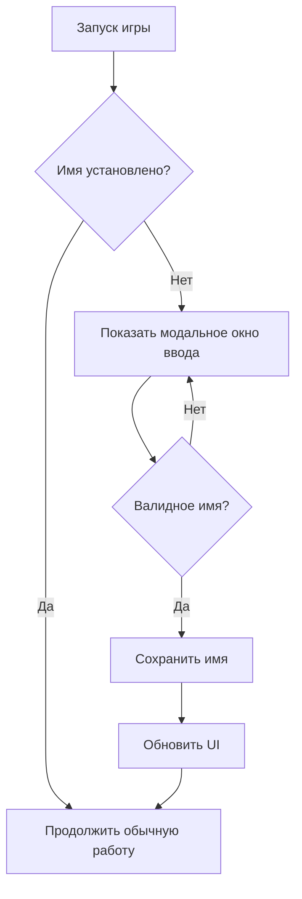

# План: Обязательное создание имени игрока

## Текущая ситуация
- Имя игрока по умолчанию "Игрок" устанавливается автоматически при первом запуске
- Игра может начинаться с именем "Игрок"
- Есть кнопка "Сменить имя" для ручного изменения

## Требование
Имя игрока должно быть обязательно создано (игра не должна начинаться с именем по умолчанию).

## Решение
При первом запуске игры автоматически открывать окно для ввода имени (принудительно).

## Изменения в коде

### 1. Обновление `src/scripts/services/storage.js`
- Изменить метод `getPlayerName()`: возвращать `null` или пустую строку, если имя не установлено (вместо "Игрок")
- **Альтернатива**: оставить возврат "Игрок" для обратной совместимости, но добавить метод `isPlayerNameSet()` для проверки

### 2. Обновление `src/scripts/main.js`
- Убрать автоматическую установку имени "Игрок" в методе `init()` (строки 41-43)
- Добавить асинхронный метод `ensurePlayerName()`, который:
  - Проверяет, установлено ли имя (не равно "Игрок" или не пустое)
  - Если имя не установлено, показывает модальное окно `ModalService.showPrompt` с обязательным вводом
  - Окно должно быть обязательным (нельзя отменить без ввода)
- Вызвать `ensurePlayerName()` после инициализации UI

### 3. Обновление `src/scripts/ui/modals.js` (опционально)
- Добавить опцию `required: true` в `showPrompt`, которая:
  - Скрывает кнопку "Отмена"
  - Не позволяет закрыть окно по Escape
  - Требует ввода непустого имени
- Или обрабатывать отмену в основном коде (повторно показывать окно)

### 4. Блокировка интерфейса
- Во время показа модального окна заблокировать кнопку "Начать игру" (добавить атрибут `disabled`)
- Разблокировать после успешного ввода имени

### 5. Сценарии тестирования
1. **Первый запуск (очищенный localStorage)**:
   - Открывается игра → автоматически появляется окно ввода имени
   - Без ввода имени игра не начинается
   - После ввода имени отображается в меню

2. **Повторный запуск (имя уже установлено)**:
   - Окно не появляется
   - Имя отображается корректно

3. **Отмена ввода (если разрешена)**:
   - При нажатии "Отмена" окно появляется снова
   - Или игра остаётся заблокированной

4. **Ввод пустого имени**:
   - Валидация предотвращает сохранение
   - Показывается сообщение об ошибке

## Диаграмма потока

## Файлы для изменения
1. `src/scripts/main.js` - инициализация и вызов окна
2. `src/scripts/services/storage.js` - логика хранения имени
3. `src/scripts/ui/modals.js` - опциональные улучшения модального окна
4. `styles.css` - стили для заблокированной кнопки (если нужно)

## Примечания
- Учитывайте фидбек пользователя о редизайне интерфейса (убрать лишние кнопки, сетевую функцию сделать настройкой, настройки убрать в меню шестеренки). Эти изменения могут быть выполнены отдельно после реализации обязательного имени.
- Обеспечьте обратную совместимость: существующие пользователи с именем "Игрок" должны пройти через принудительный ввод? (Можно считать, что если имя "Игрок", то это значение по умолчанию и нужно предложить сменить)

## Следующие шаги
1. Утвердить план
2. Переключиться в режим Code для реализации
3. Протестировать сценарии
4. При необходимости внести корректировки