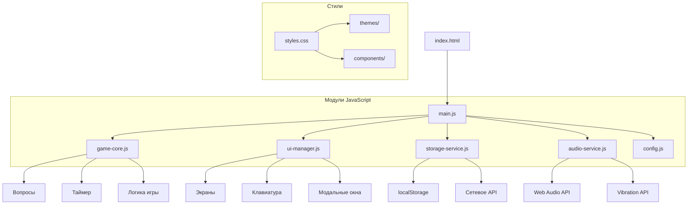

# Анализ проекта "Тренажер умножения"

## Обзор проекта
Веб-приложение для тренировки таблицы умножения с игровой механикой, таймером и таблицей лидеров.

**Текущее состояние:** Полностью рабочее приложение с базовым функционалом.

## Архитектурный анализ

### Текущая архитектура
```
Монолитная структура:
index.html (UI) → script.js (540 строк) ← styles.css
```

### Предлагаемая модульная архитектура



## Выявленные проблемы

### Критические
1. **Сетевой режим не реализован** - кнопки работают, но нет реальной сетевой функциональности
2. **Проблемы с AudioContext** - создание нового контекста для каждого звука
3. **Отсутствие обработки ошибок** для некоторых API

### Средней важности
4. **Магические числа** в коде (задержки, частоты)
5. **Дублирование кода** в функциях настроек
6. **Отсутствие модульности** - один файл на 540 строк

### Улучшения UX
7. **Доступность (a11y)** - нет ARIA-атрибутов
8. **Устаревший prompt()** для ввода имени
9. **Отсутствие анимаций** переходов

## План развития

### Этап 1: Базовые улучшения (1-2 недели)
1. **Рефакторинг кода**:
   - Разделить на модули: `game/`, `ui/`, `services/`, `utils/`
   - Создать конфигурационный файл с константами
   - Устранить дублирование кода

2. **Исправление проблем**:
   - Оптимизировать AudioContext (один экземпляр)
   - Добавить обработку ошибок API
   - Заменить prompt() на кастомное модальное окно

3. **Доступность**:
   - Добавить ARIA-атрибуты
   - Улучшить клавиатурную навигацию
   - Проверить цветовую контрастность

### Этап 2: Расширение функциональности (1-2 месяца)
1. **Новые режимы игры**:
   - Уровни сложности (легкий, средний, сложный)
   - Разные типы вопросов (деление, комбинированные)
   - Режим на время vs режим на точность

2. **Улучшение UX**:
   - Анимации переходов
   - Темная тема
   - Подробная статистика

3. **PWA-оптимизация**:
   - Добавить manifest.json
   - Service Worker для офлайн-работы
   - Возможность установки на устройство

### Этап 3: Продвинутые функции (3-6 месяцев)
1. **Сетевые возможности**:
   - Онлайн-таблица лидеров
   - Мультиплеерные режимы
   - Синхронизация прогресса

2. **Образовательные функции**:
   - Адаптивная сложность (AI-подбор вопросов)
   - Анализ ошибок и рекомендации
   - Интеграция с образовательными платформами

3. **Мобильная разработка**:
   - Нативное приложение через Capacitor
   - Push-уведомления для напоминаний

## Технический стек и инфраструктура

### Рекомендуемые инструменты
- **Сборка:** Vite (быстрая настройка, HMR)
- **Линтинг:** ESLint + Prettier
- **Тестирование:** Jest (unit), Playwright (e2e)
- **Деплой:** GitHub Pages / Netlify / Vercel

### Структура проекта после рефакторинга
```
src/
├── index.html
├── styles/
│   ├── main.css
│   ├── themes/
│   └── components/
├── scripts/
│   ├── main.js
│   ├── game/
│   │   ├── core.js
│   │   ├── questions.js
│   │   └── timer.js
│   ├── ui/
│   │   ├── screens.js
│   │   ├── keyboard.js
│   │   └── modals.js
│   ├── services/
│   │   ├── storage.js
│   │   ├── audio.js
│   │   └── network.js
│   └── utils/
│       ├── constants.js
│       └── helpers.js
└── assets/
    ├── icons/
    └── sounds/
```

## Приоритеты реализации

### Высокий приоритет (неделя 1)
1. Рефакторинг на модули
2. Исправление AudioContext
3. Добавление обработки ошибок

### Средний приоритет (недели 2-4)
1. Улучшение доступности
2. Замена prompt() на модальные окна
3. Добавление базовых анимаций

### Низкий приоритет (месяц 2+)
1. Новые режимы игры
2. PWA-функции
3. Сетевые возможности

## Оценка усилий

| Задача | Сложность | Время |
|--------|-----------|-------|
| Базовый рефакторинг | Низкая | 2-3 дня |
| Исправление критических проблем | Средняя | 3-5 дней |
| Улучшение доступности | Средняя | 4-6 дней |
| Добавление новых режимов | Высокая | 1-2 недели |
| PWA-оптимизация | Средняя | 3-5 дней |
| Сетевые функции | Высокая | 2-3 недели |

## Рекомендации

1. **Начните с рефакторинга** - это упростит все последующие изменения
2. **Сфокусируйтесь на доступности** - улучшит UX для всех пользователей
3. **Добавьте базовое тестирование** - предотвратит регрессии
4. **Рассмотрите PWA** - увеличит вовлеченность мобильных пользователей
5. **Планируйте сетевые функции поэтапно** - начните с простой онлайн-таблицы лидеров

## Следующие шаги

1. Создать ветку для рефакторинга
2. Разработать план миграции на модульную архитектуру
3. Поэтапно внедрять изменения, тестируя после каждого этапа
4. Собирать обратную связь от пользователей
5. Планировать релизы с новыми функциями