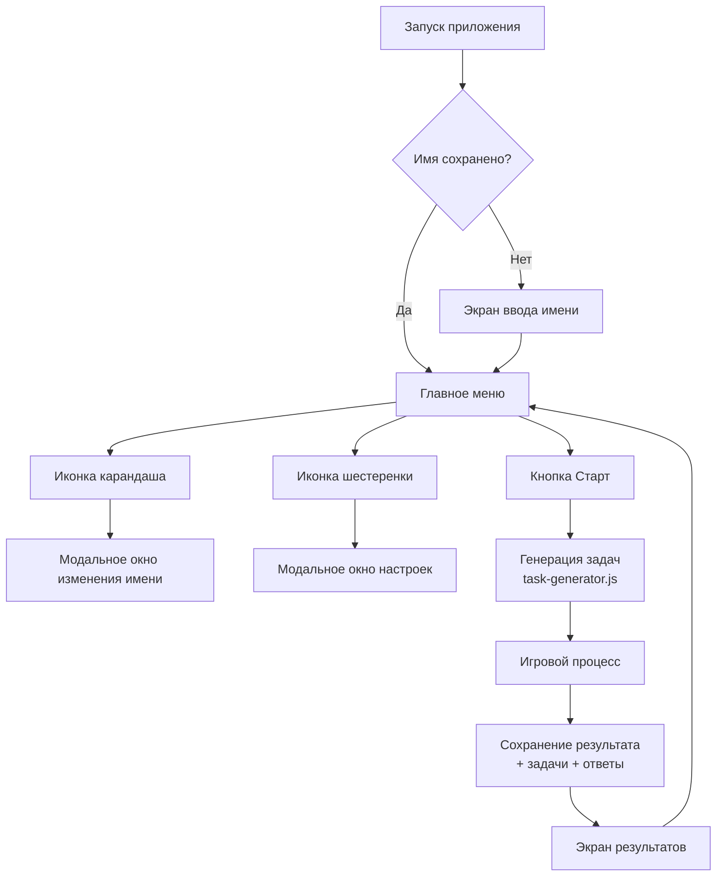

# План рефакторинга главного меню и логики игры

## Текущее состояние
Проект состоит из трех файлов:
- `index.html` - структура интерфейса с тремя экранами (меню, игра, результаты)
- `styles.css` - стили
- `script.js` - вся логика игры (540 строк)

## Требования
1. Перед входом в главное меню необходимо ввести имя игрока
2. Убрать лишние кнопки и связанные с ними функции, оставить только кнопку "старт"
3. Добавить возможность изменять имя кнопкой "карандаш" справа от текущего имени
4. Добавить кнопку настройки "шестеренка" и поместить туда настройки связанные со звуком и вибрацией
5. Задачи должны генерироваться отдельным модулем, для дальнейшего его развития
6. Все задачи должны быть сгенерированы до начала игры
7. Все задачи и ответы на них должны сохраняться вместе с результатом игры

## Детальный план реализации

### 1. Экран ввода имени перед главным меню
**Цель:** При первом посещении или если имя не установлено, показать экран ввода имени.

**Реализация:**
- Добавить новый экран `nameInputScreen` в `index.html`
- Расположить его перед `menuScreen` (по умолчанию видимый)
- Содержит:
  - Заголовок "Введите ваше имя"
  - Поле ввода с плейсхолдером
  - Кнопка "Продолжить"
- При нажатии "Продолжить":
  - Сохранить имя в `localStorage`
  - Скрыть `nameInputScreen`, показать `menuScreen`
- Если имя уже сохранено, сразу показывать `menuScreen`

**Изменения в файлах:**
- `index.html`: добавить новый section
- `script.js`: добавить логику проверки и переключения
- `styles.css`: добавить стили для нового экрана

### 2. Обновленное главное меню
**Цель:** Упростить меню, оставив только необходимые элементы.

**Текущие элементы для удаления:**
- Кнопка "Подключить" (и связанный функционал)
- Кнопка "Сменить имя" (заменяется иконкой карандаша)
- Кнопка "Сетевой режим" (и связанный функционал)
- Панель статусов подключения и сетевого режима

**Новая структура меню:**
1. Заголовок "Тренажер умножения" и подзаголовок
2. Панель игрока с:
   - Текстом "Игрок: [имя]"
   - Иконкой карандаша справа (кнопка для изменения имени)
3. Кнопка "Начать игру" (основная, единственная в меню)
4. Кнопка "Настройки" с иконкой шестеренки
5. Таблица лидерборда (оставить без изменений)

**Изменения в файлах:**
- `index.html`: переработать структуру menuScreen
- `script.js`: удалить обработчики удаляемых кнопок, добавить обработчики для новых элементов
- `styles.css`: обновить стили для новой компоновки

### 3. Модальное окно настроек
**Цель:** Вынести настройки звука и вибрации в отдельное модальное окно.

**Реализация:**
- Добавить модальное окно `settingsModal` в `index.html`
- Содержит:
  - Заголовок "Настройки"
  - Переключатель "Звук" (чекбокс)
  - Переключатель "Вибрация" (чекбокс)
  - Кнопка "Закрыть"
- Открывается по клику на кнопку "Настройки" (шестеренка)
- Закрывается по клику на "Закрыть" или вне модального окна

**Изменения в файлах:**
- `index.html`: добавить модальное окно
- `script.js`: добавить логику открытия/закрытия, синхронизацию с localStorage
- `styles.css`: стили для модального окна (overlay, контейнер)

### 4. Отдельный модуль генератора задач
**Цель:** Вынести логику генерации задач в отдельный файл для независимого развития.

**Реализация:**
- Создать файл `task-generator.js`
- Перенести туда:
  - Константы `FIRST_MULTIPLIERS`, `SECOND_MIN`, `SECOND_MAX`, `ROUNDS`
  - Функцию `buildQuestionList()`
  - Функцию `randomInt()` (или оставить в основном скрипте)
- Экспортировать функцию генерации задач
- Импортировать в `script.js`

**Преимущества:**
- Возможность добавлять новые типы задач без изменения основного кода
- Легкое тестирование
- Возможность использовать разные алгоритмы генерации

### 5. Сохранение задач и ответов с результатом игры
**Цель:** Сохранять полную информацию о каждой игре для истории.

**Текущее состояние:**
- `answersLog` содержит массив объектов с вопросами и ответами
- Отображается на экране результатов, но не сохраняется постоянно

**Новое требование:**
- Сохранять вместе с результатом игры:
  - Массив всех задач (a, b)
  - Ответы игрока
  - Правильные ответы
  - Статус (верно/неверно)
  - Время ответа (опционально)

**Реализация:**
- Расширить объект результата в функции `saveResult()`:
  ```javascript
  {
    playerName,
    totalTimeSec,
    score,
    rounds,
    finishedAt,
    tasks: currentQuestions, // массив задач
    answers: answersLog,     // массив ответов
    gameId: Date.now()       // уникальный идентификатор
  }
  ```
- Обновить `STORAGE_KEYS` для хранения истории игр
- Добавить возможность просмотра истории (опционально, на будущее)

### 6. Архитектурная диаграмма



### 7. Порядок выполнения работ

1. **Создание экрана ввода имени**
   - Добавить HTML-разметку
   - Добавить CSS-стили
   - Реализовать логику в script.js

2. **Рефакторинг главного меню**
   - Удалить лишние кнопки из HTML
   - Обновить структуру панели игрока
   - Добавить иконки карандаша и шестеренки
   - Обновить обработчики событий

3. **Создание модального окна настроек**
   - Добавить HTML-разметку модального окна
   - Стилизовать overlay и контейнер
   - Реализовать открытие/закрытие
   - Интегрировать существующие настройки звука и вибрации

4. **Вынос генератора задач в отдельный модуль**
   - Создать файл task-generator.js
   - Перенести константы и функции
   - Обновить импорты в script.js

5. **Улучшение системы сохранения результатов**
   - Расширить объект результата
   - Обновить функцию saveResult()
   - Проверить сохранение и отображение

6. **Тестирование и отладка**
   - Проверить все сценарии
   - Убедиться в сохранении данных
   - Проверить адаптивность

### 8. Ожидаемые результаты

После реализации:
- Более чистый и интуитивный интерфейс
- Модульная архитектура, упрощающая дальнейшее развитие
- Полная история игр с задачами и ответами
- Гибкая система настроек
- Возможность легко добавлять новые типы задач

## Вопросы для уточнения

1. Нужно ли сохранять историю всех игр или только последнюю?
2. Хотите ли вы добавить возможность просмотра истории прошлых игр?
3. Нужна ли валидация имени (минимальная длина, запрещенные символы)?
4. Следует ли полностью удалить сетевой функционал или оставить "на будущее"?
5. Нужны ли дополнительные настройки (тема, сложность, количество вопросов)?